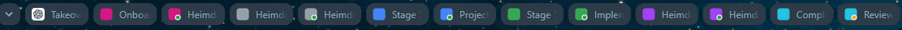

# Agent Tabs

**Version 0.2.0**

Agent Tabs is a Chrome extension for keeping multiple ChatGPT agent tabs easy to distinguish at a glance. Assign each tab a colour, then use the small status dot to see when a ChatGPT agent is still working or has finished and is ready for the next prompt.

Manual colourising also works on normal Chrome tabs; automatic state dots are currently ChatGPT-specific.



## Install

### Option 1 — Clone the repository

```bash
git clone https://github.com/bigggs/agent-tabs.git
cd agent-tabs
```

### Option 2 — Download the ZIP

1. On GitHub, click the green **Code** button.
2. Click **Download ZIP**.
3. Extract the ZIP file.
4. Open the extracted `agent-tabs` folder.


Then:

1. Open `chrome://extensions` in Chrome.
2. Turn on **Developer mode**.
3. Click **Load unpacked**.
4. Select the cloned or extracted `agent-tabs` folder.
5. Refresh any ChatGPT tabs that were already open.

Requires Chrome 150 or newer.

## Use

Right-click any tab → **Colour** → choose a colour.

Use **Colour → Remove colour** to restore the normal favicon.

For coloured ChatGPT tabs, the small dot shows agent state:

- 🟡 **Yellow** — working / generating
- 🟢 **Green** — finished in the background and ready for the next prompt
- 🔴 **Red** — error detected
- **No dot** — idle or already viewed

| Working | Ready |
| --- | --- |
|  |  |
