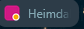
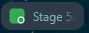

# Agent Tabs

Agent Tabs is a Chrome extension for visually separating tabs used for ChatGPT agents or other long-running work. Assign each tab a colour, and coloured ChatGPT tabs also show a small live status dot.

## Install

1. Download or clone this repository.
2. Open `chrome://extensions` in Chrome.
3. Turn on **Developer mode**.
4. Click **Load unpacked**.
5. Select the `agent-tabs` folder containing `manifest.json`.
6. Refresh any ChatGPT tabs that were already open.

Requires Chrome 150 or newer.

## Use

Right-click a tab → **Colour** → choose a colour.

On coloured ChatGPT tabs:

- 🟡 **Yellow** — working / generating
- 🟢 **Green** — finished in the background and ready to view
- 🔴 **Red** — error detected
- **No dot** — idle or already viewed

| Working | Ready |
| --- | --- |
|  |  |

Use **Colour → Remove colour** to restore the normal favicon.
